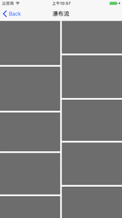
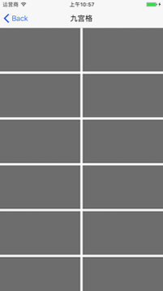
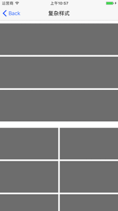

# JJCommonCollectionViewLayout
一个好用的布局，遵守几个代理，即可实现想要的布局。(OC版本)

支持cocoapods
pod 'JJCommonCollectionViewLayout'


# 1.瀑布流

# 2.九宫格

# 3.复杂样式

# 4.核心代码

```objc
/**
 初始化方法
 
 @param dataSource 代理
 */
- (instancetype)initWithDataSource:(__weak id<JJCommonCollectionViewLayoutDataSource>)dataSource;


#pragma mark - JJCommonCollectionViewLayoutDataSource代理

@class JJCommonCollectionViewLayout;
@protocol JJCommonCollectionViewLayoutDataSource <NSObject>

@required//必须实现的代理
/**
 返回每一个item的高度 高度不同则按瀑布流方式排布
 
 @param layout JJCommonCollectionViewLayout
 @param indexPath indexPath
 @param itemWith item的宽度
 @param rowMargin 行间距
 @return 每一个item的高度
 */

- (CGFloat)commonCollectionViewLayout:(JJCommonCollectionViewLayout *)layout
             heightForItemAtIndexPath:(NSIndexPath *)indexPath
                            itemWidth:(CGFloat)itemWith
                            rowMargin:(CGFloat)rowMargin;


@optional//选择实现的代理 设置布局的属性

/** 每一个分区有多少列 */
- (NSInteger)commonCollectionViewLayout:(JJCommonCollectionViewLayout *)layout
               numberOfColumnsInSection:(NSInteger)section;

/** 整体的内边距 */
- (UIEdgeInsets)commonEdgeInsetsOfOverallInCollectionViewLayout:(JJCommonCollectionViewLayout *)layout;

/** 每一分区的内边距 */
- (UIEdgeInsets)commonCollectionViewLayout:(JJCommonCollectionViewLayout *)layout
                       edgeInsetsInSection:(NSInteger)section;

/** 每一列的间距 */
- (CGFloat)commonCollectionViewLayout:(JJCommonCollectionViewLayout *)layout
              marginOfColumnInSection:(NSInteger)section;

/** 每一行的间距 */
- (CGFloat)commonCollectionViewLayout:(JJCommonCollectionViewLayout *)layout
                 marginOfRowInSection:(NSInteger)section;

/** 区头，区尾的高度 */
- (CGFloat)commonCollectionViewLayout:(JJCommonCollectionViewLayout *)layout
  heightForSupplementaryViewInSection:(NSInteger)section
              supplementaryViewOfKind:(NSString *)elementKind;

/** 区头，区尾的内边距 */
- (UIEdgeInsets)commonCollectionViewLayout:(JJCommonCollectionViewLayout *)layout
   edgeInsetsForSupplementaryViewInSection:(NSInteger)section
                   supplementaryViewOfKind:(NSString *)elementKind;
@end

```
